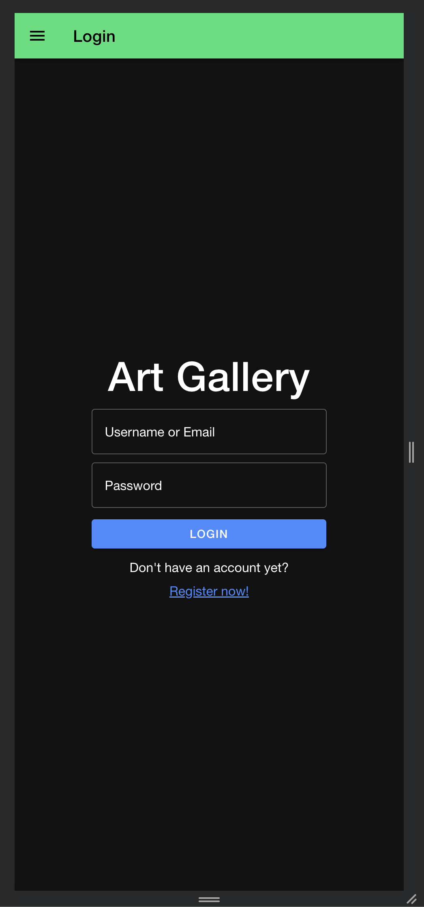
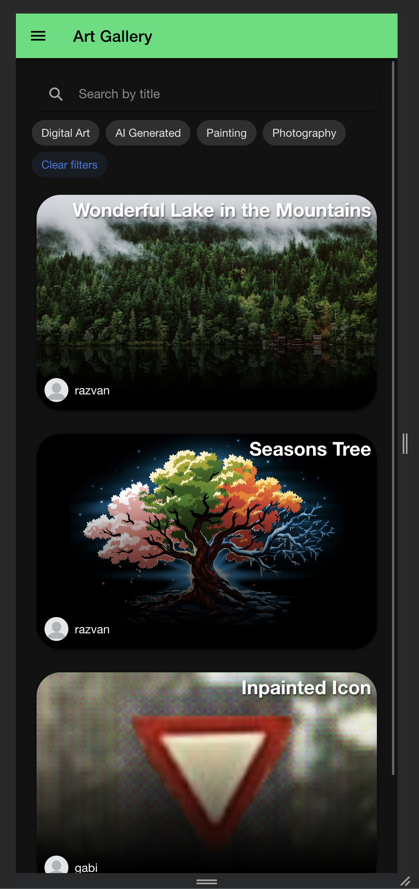
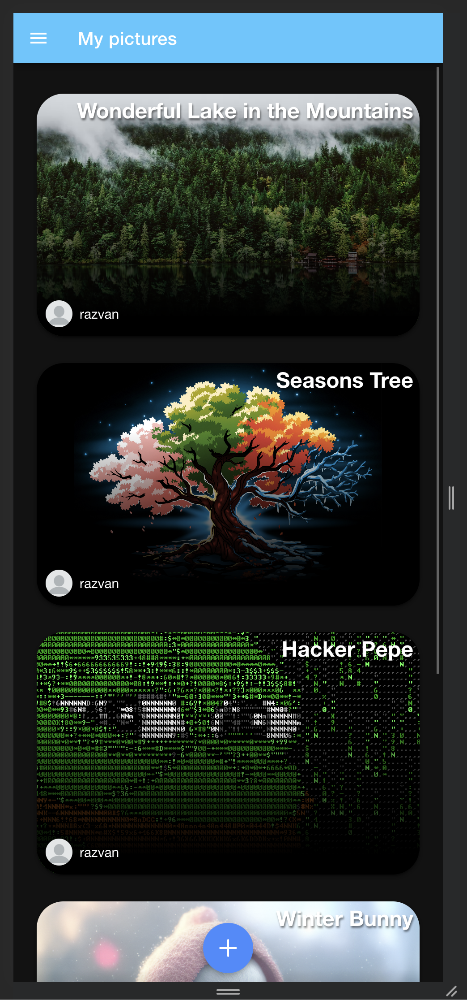
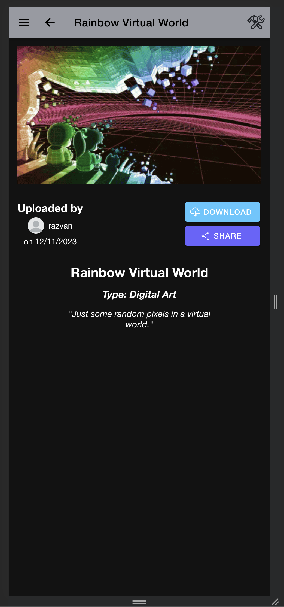
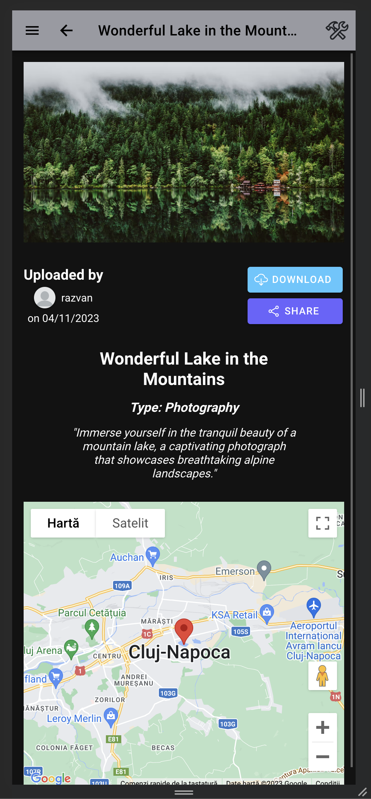
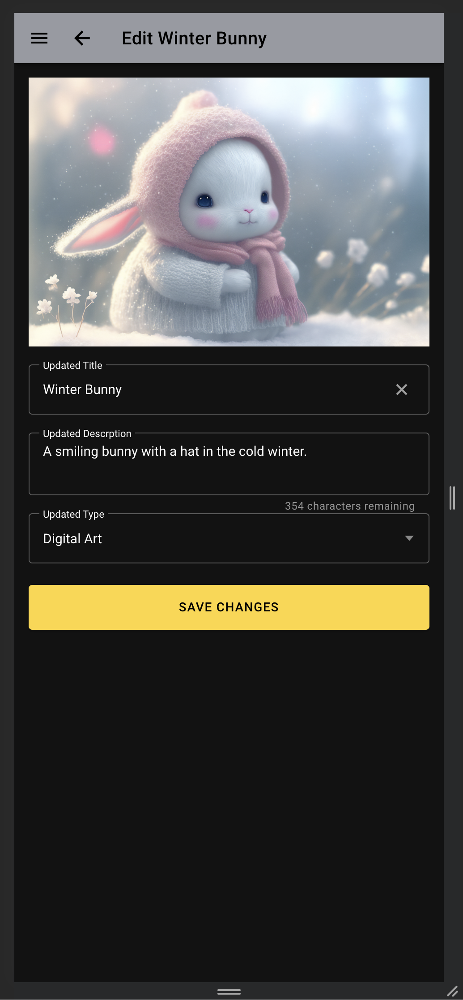

# Art Gallery

This mobile application was created for users to showcase and explore various forms of visual art, including photographs, digital arts, and paintings. Users can also mark some of their location on the map to share the location the photographies were taken.

The frontend application was integrated in TypeScript with Ionic (for cross-platform experience).

For the backend environment, Prisma framework with SQLite was used for data persistency, and the pictures were saved using the OS file system. RESTful architecture was used for accesing the resources from the other environments, and there are some private resources which requires JWT authentication. Also, a web socket server was managed to authenticate the user when its resources are changed.

## Application

Some key features:

- Authentication using JWT tokens
- Web sockets to update some resources when updated on the backend
- Showing the network status, and when offline and a picture is trying to be added, the data and the request will be stored locally and they will be send when the device is back online.
- Pagination, search and filtering for the global resources.
- Camera was used for taking pictures as an alternative to just uploading them, the photo also being saved on the device before sending it to the server.
- Google Maps API was used to showcase the locations of some photographies for a better user experience.



## Setup

### Frontend setup

1. Be sure to have `node.js` installed.
2. Enter the `frontend` directory and install the required packages using the command:

```bash
$ npm install
```

3. Run the frontend server using the command:

```bash
$ ionic serve
```

### Frontend environment variables

You should create a folder named `secrets` inside `frontend/src` that should contain an `index.ts` with the following:

```javascript
export const GOOGLE_MAPS_API_KEY = "<GOOGLE MAPS API KEY>";
```

### Backend setup

1. Be sure to have `node.js` installed.
2. Enter the `backend` directory and installed the required node packages using the command:

```bash
$ npm install
```

3. Run the server using the command:

```bash
$ npm run dev
```

### Backend environment variables

The `.env` variable should be in the backend directory, and should look like this:

```bash
DATABASE_URL="file:./dev.db"
PORT=<DESIRED PORT>
JWT_SECRET=<SOME JWT TOKEN>
```
